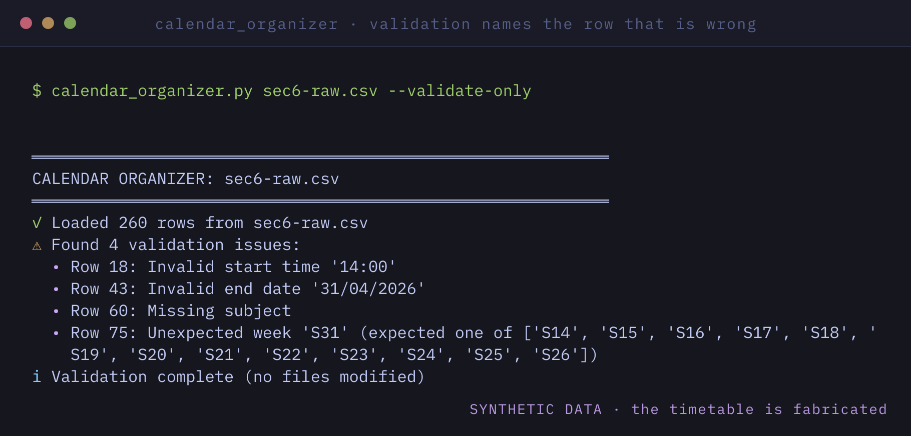
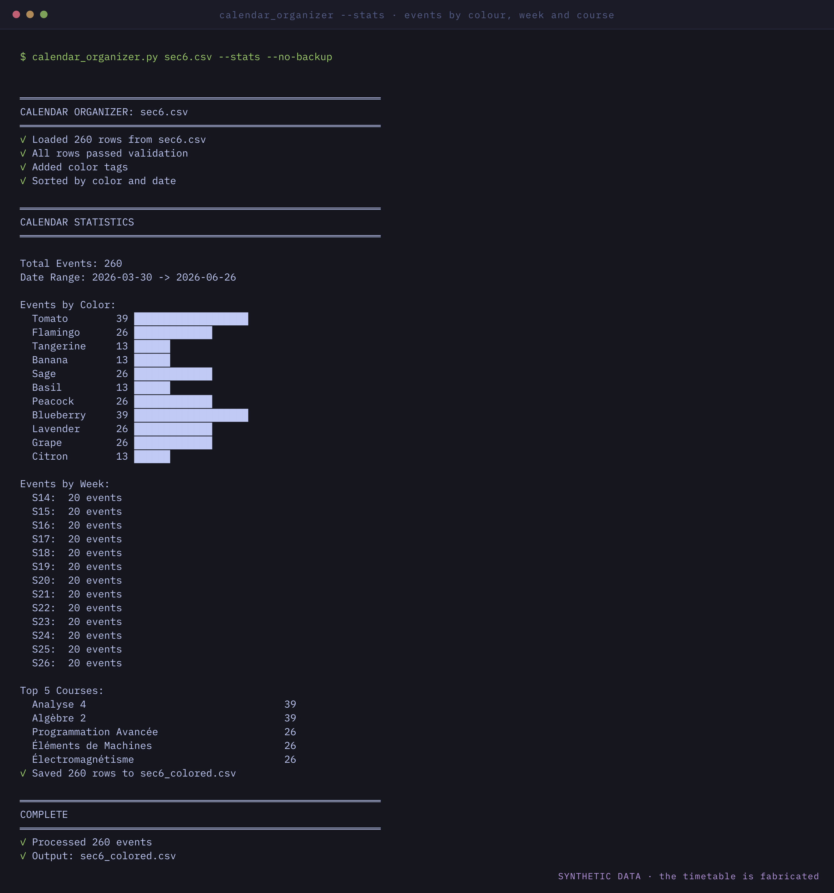
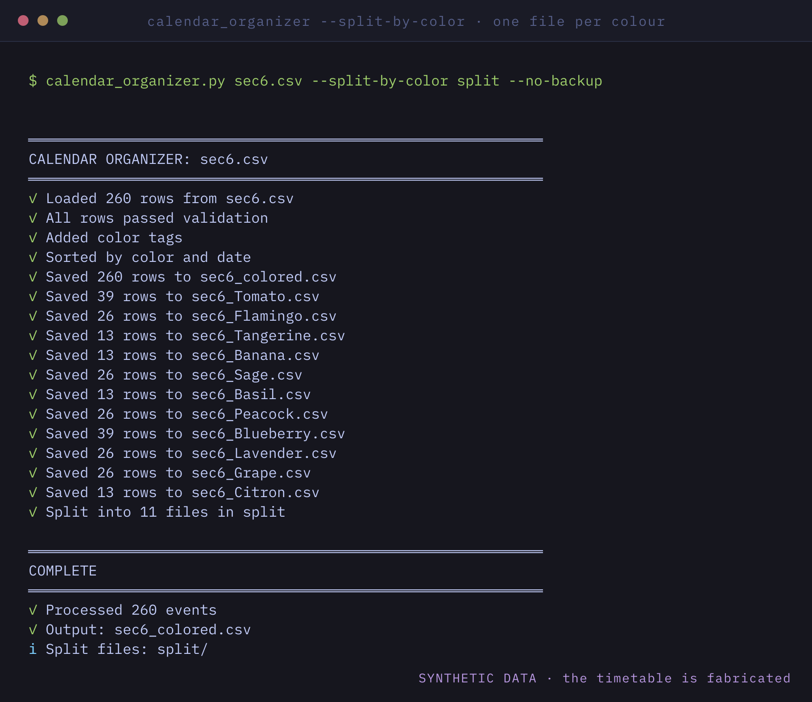

# Calendar

Scripts I use to get the Sec6 timetable into Google Calendar without
entering three hundred events by hand.

The flow is: the schedule starts as a CSV, the script checks it for
mistakes, assigns a colour per course, and then uploads it.

## Screenshots

The timetable in these is fabricated. The module names are the real S6 ones,
the rooms are invented, and no teacher appears anywhere.

Nothing is uploaded until the CSV is clean. Four bad rows here, each named by
its row number: a 24-hour time where the CSV wants 12-hour, a day and month
swapped, a missing course, and a week outside S14 to S26.

260 events over thirteen weeks, broken down by colour, by week and by course,
so the timetable can be checked before it reaches the calendar.

Splitting by colour gives one file per module, for importing a course at a
time rather than the whole semester at once.

## What it checks

- dates and times parse
- weeks are inside S14 to S26
- no duplicate events
- no missing fields

Errors come back with the row number so you can go fix the CSV.

## Colours

Courses get one of the 11 Google Calendar colours based on the course name.
The matching is loose on purpose because the course names in the CSV have
typos and inconsistent accents. The mapping is at the top of the script if
you want to change it.

## Requirements

Python 3.10 or newer, and Google Calendar API credentials (OAuth, the
first run opens a browser).

    pip install -r requirements.txt

## Usage

    python calendar_organizer.py

It makes a backup of the CSV before touching anything. There is also an ICS
export if you would rather import the file yourself, and a stats mode that
prints how many events per week and per course.
